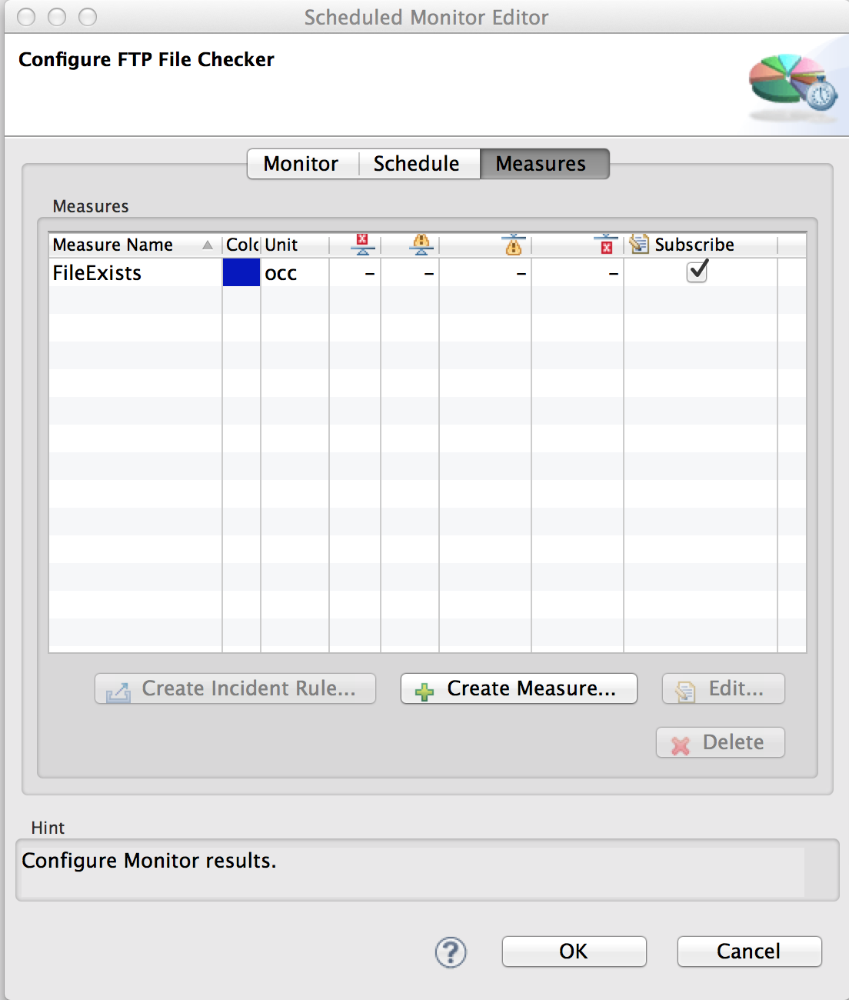
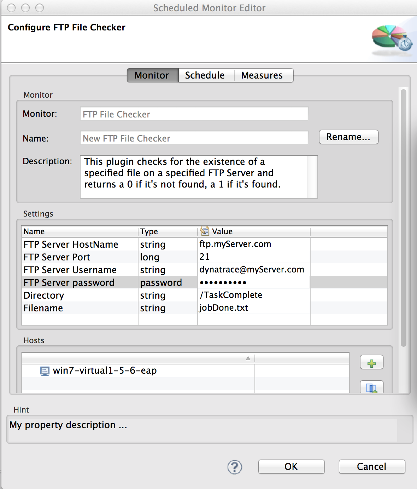
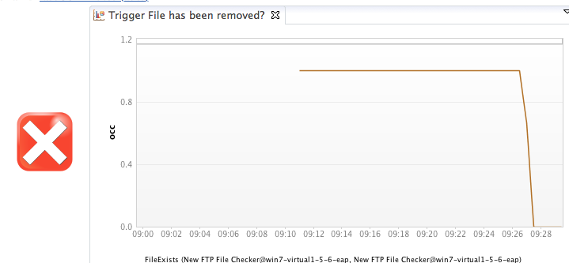

# FTP File Checker Plugin

## Overview

This plugin checks the existence of a given file on an FTP Server and returns the result as a measure value of 0 or 1.

## Plugin Details

| Name | FTP File Checker Plugin
| :--- | :---
| Author | Joe Hoffman 
| Supported dynaTrace Versions | >= 5.5
| License | [dynaTrace BSD](dynaTraceBSD.txt)
| Support | [Not Supported](https://community.compuwareapm.com/community/display/DL/Support+Levels)
| Release History | Dec 16, 2013. v1.0.1 - Initial Release
| | Dec 18, 2013, v1.0.2 - Better error handling, compiled for v5.5
| Download | [FTPFileChecker v1.0.2](com.dynatrace.FTPFileChecker_1.0.2.jar)

## Provided Measures

Measure

Description

FileExists

1; if the specified file is found on the FTP Server

0; if the specified file is not found

## Screenshot of the measures screen

## Configuration

The following properties need to be defined when setting up this monitor

**Property Name**

**Type**

**Default Value**

**Notes**

FTP Server Hostname

String

localhost

hostname or IP address

FTP Server Port

Long

21

changing this to 22 will not invoke SSL. SSL is currently not supported by this plugin but could easily be added.

FTP Server Username

String

FTP Server Password

String

Directory

String

/

If left blank, the filename is checked in the default login directory. To check on the file located in the **foo** directory, this field would contain **/foo**.

Filename

String

fileToCheck.txt

## Screenshot of the Configuration page

## Usage Example

This plugin can be useful for detecting when a given file does or does not exist on a file system that is accessible by FTP. This can be useful when a file existence or absence is used as a trigger
for the beginning or completion of a batch job. The resulting measure can be plotted, displayed as a Traffic Light, and alerted upon via an action. Below is an example of showing the status of the
file and showing an alert condition via a Traffic light when the file is not found.

## Installation

Import the Plugin into the dynaTrace Server via the dynaTrace Server Settings menu -> Plugins -> Install Plugin. For details how to do this please refer to the dynaTrace documentation:

[Plugin Management](https://community.compuwareapm.com/community/display/DOCDT55/Plugin+Management)

